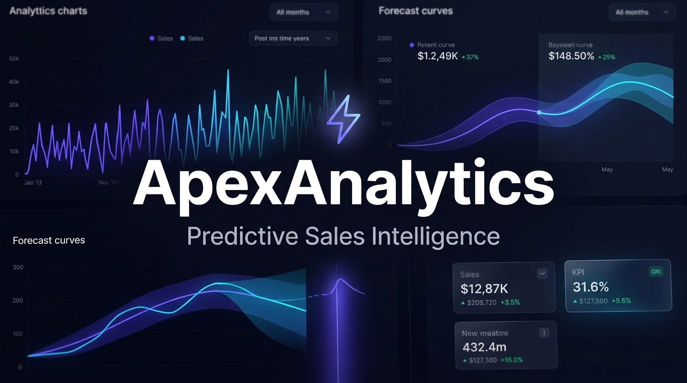
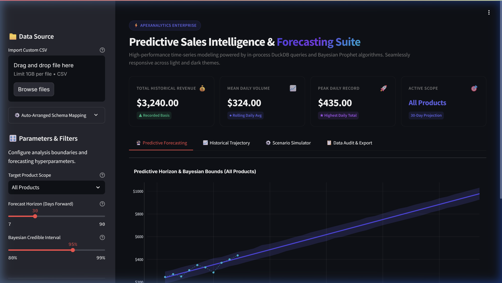
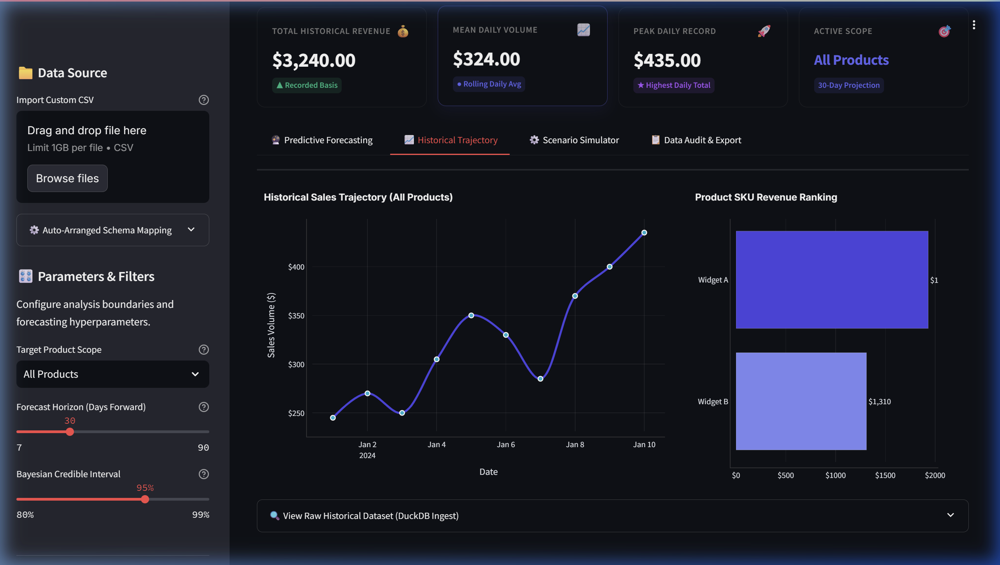
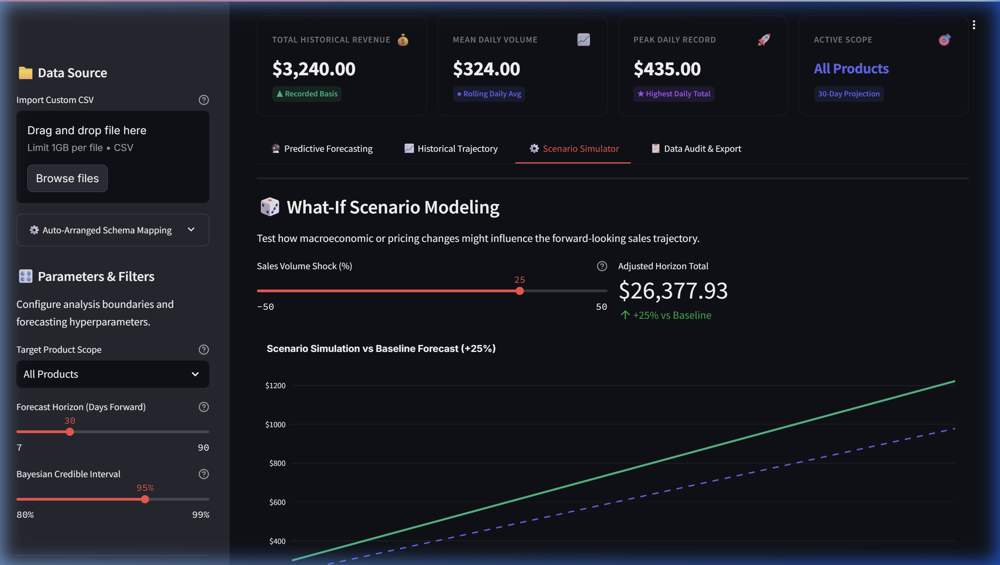
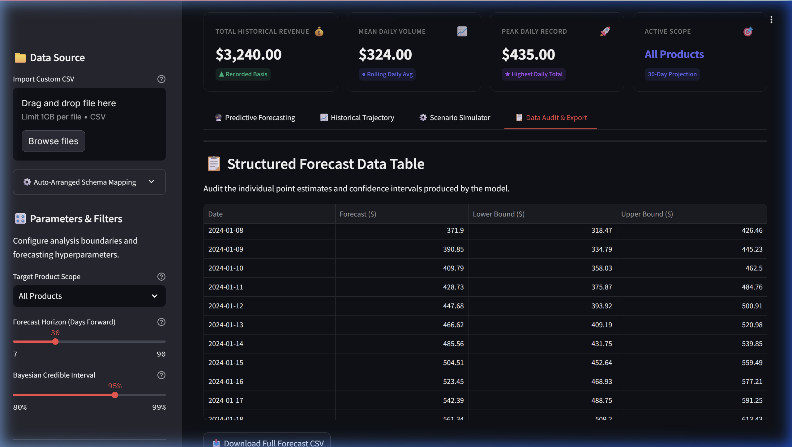
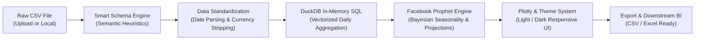

<div align="center">

# ApexAnalytics Enterprise
### Predictive Sales Intelligence & Time-Series Forecasting Platform

[](https://streamlit.io/)
[](https://duckdb.org/)
[](https://facebook.github.io/prophet/)
[](https://plotly.com/)
[](https://www.python.org/)
[](LICENSE)

<br/>

**A production-ready, theme-adaptive sales intelligence and automated Bayesian forecasting platform.**  
Engineered with in-process vectorized SQL execution via **DuckDB**, probabilistic time-series modeling via **Facebook Prophet**, and reactive visualizations via **Plotly** and **Streamlit**.

<br/>



</div>

---

## Table of Contents

- [Overview](#-overview)
- [Key Features](#-key-features)
- [Visual Tour & Workspaces](#-visual-tour--workspaces)
- [Architecture & Data Pipeline](#-architecture--data-pipeline)
- [Quickstart Guide](#-quickstart-guide)
  - [Prerequisites](#1-prerequisites)
  - [Installation](#2-installation)
  - [Running the Application](#3-running-the-application)
- [Data Ingestion & Schema Support](#-data-ingestion--schema-support)
  - [Automatic Schema Detection](#automatic-schema-detection)
  - [How to Connect Your Data](#how-to-connect-your-data)
  - [Recommended CSV Schema](#recommended-csv-schema)
- [Project Directory Structure](#-project-directory-structure)
- [Configuration & Settings](#-configuration--settings)
- [Deployment Guide](#-deployment-guide)
  - [Streamlit Community Cloud](#streamlit-community-cloud)
  - [Docker Containerization](#docker-containerization)
- [Pushing to GitHub Guide](#-pushing-to-github-guide)
- [Troubleshooting & FAQ](#-troubleshooting--faq)
- [License & Contributions](#-license--contributions)

---

## Overview

**ApexAnalytics Enterprise** bridges the gap between raw e-commerce transaction streams and actionable executive decision-making. Built for data analysts, revenue operators, and SaaS builders, this platform ingests arbitrary transaction logs, standardizes timestamps, collapses intra-day noise, and delivers probabilistic revenue forecasts with calibrated credible intervals.

Unlike conventional dashboards that choke on large files or require complex external database servers, ApexAnalytics leverages **DuckDB's columnar vectorized engine** to process logs up to **1GB directly in-memory**, executing aggregates at near C++ speed.

---

## Key Features

| Capability | Technical Highlight | Value Delivered |
| :--- | :--- | :--- |
| **Intelligent Schema Detection** | Heuristic keyword matching & regex normalization | Drag and drop any sales CSV without manually modifying or renaming headers. |
| **ectorized In-Process SQL** | Embedded DuckDB engine | Zero database servers required; lightning-fast aggregations on multi-million row logs. |
| **Automated Bayesian Forecasts** | Facebook Prophet with adaptive seasonality | Decomposes trends, weekly cycles, and yearly seasonal patterns with 80%–99% uncertainty bands. |
| **Universal Theme Adaptation** | Dynamic CSS custom properties (`var(--background-color)`) | Flawlessly renders in both Light and Dark modes with zero contrast artifacts or illegible charts. |
| **What-If Scenario Simulator** | Real-time parametric volume shock modeling (-50% to +50%) | Test macroeconomic, supply chain, or pricing shifts against baseline projections. |
| **Clean SKU Revenue Ranking** | Top-N horizontal bar rankings with direct data labels | Instant visibility into revenue drivers without horizontal axis clutter or squished barcodes. |
| **Data Audit & 1-Click Export** | Clean tabular export with point estimates & confidence bounds | Effortlessly port projections into Snowflake, BigQuery, Excel, or Google Sheets. |
| **Enterprise Fault-Tolerance** | Graceful degradation, empty-state traps, and fallback rules | Eliminates runtime exceptions on sparse datasets or mismatched column types. |

---

## Visual Tour & Workspaces

The application is structured into four specialized executive modules:

### 1.Predictive Forecasting & Bayesian Confidence Bounds
Fit non-linear trends with automated changepoint detection and Bayesian credible intervals (80%, 90%, 95%, 99%).


---

### 2.Historical Trajectory & Product SKU Ranking
Inspect long-term historical velocity and identify top-grossing products with clear direct data labels.


---

### 3.Interactive What-If Scenario Simulator
Stress-test future performance under volume growth or supply disruption scenarios with dynamic delta metrics.


---

### 4.Structured Forecast Data Audit & CSV Export
Audit raw point estimates (`yhat`), lower bounds (`yhat_lower`), and upper bounds (`yhat_upper`) with one-click export.


---

## Architecture & Data Pipeline



1. **Ingestion & Parsing:** CSV files are streamed into memory. Regex cleaners strip currency markers (`$`, `€`, `£`, `₹`) and commas.
2. **Column Inference:** Semantic matching maps ambiguous date headers (`InvoiceDate`, `order_date`), revenue fields (`Total_Amount`, `Price`), and SKU identifiers (`Product`, `Category`).
3. **DuckDB Vectorized Processing:** Intra-day orders are consolidated into daily series `(ds, product, y)` using vectorized SQL statements.
4. **Adaptive Seasonality:** Prophet dynamically evaluates sample length: activating weekly seasonality for datasets $\ge 14$ days and yearly seasonality for datasets $\ge 365$ days.
5. **Theme-Adaptive Rendering:** Custom CSS variables bind seamlessly to Streamlit's runtime theme palette.

---

## Quickstart Guide

### 1. Prerequisites
- **Python 3.9, 3.10, or 3.11** installed on your system.
- Standard C++ compiler toolchain (optional, for Prophet Stan compilation on Linux/macOS if wheels are unavailable).

### 2. Installation

1. **Clone the repository:**
   ```bash
   git clone https://github.com/your-username/apex-analytics-enterprise.git
   cd apex-analytics-enterprise
   ```

2. **Create and activate a virtual environment:**

   - **Windows (PowerShell):**
     ```powershell
     python -m venv venv
     .\venv\Scripts\Activate.ps1
     ```

   - **macOS / Linux:**
     ```bash
     python3 -m venv venv
     source venv/bin/activate
     ```

3. **Install dependencies:**
   ```bash
   pip install --upgrade pip
   pip install -r requirements.txt
   ```

### 3. Running the Application

Launch the local Streamlit development server:
```bash
streamlit run app.py
```

The application will immediately spin up at:
```text
Local URL: http://localhost:8501
Network URL: http://<your-ip>:8501
```

---

## 🔌 Data Ingestion & Schema Support

### Automatic Schema Detection
You do **not** need to manually format or sanitize your CSV files. The built-in detection heuristics automatically identify:
- **Date Column:** Recognizes `date`, `order_date`, `invoicedate`, `created_at`, `timestamp`, `ds`, `period`, etc.
- **Sales / Revenue Column:** Recognizes `sales`, `revenue`, `total_amount`, `price`, `unit_price`, `amount`, `y`, `turnover`, etc.
- **Product / Category Column:** Recognizes `product`, `item`, `category`, `sku`, `description`, `segment`, `title`, etc.

### How to Connect Your Data

#### Option 1: In-App Drag-and-Drop (Instant)
1. Open the sidebar in the dashboard.
2. Under **Data Source**, drag and drop your CSV file (supports files up to **1024MB**).
3. Review or override the automatically assigned columns using the **⚙️ Auto-Arranged Schema Mapping** expander.

#### Option 2: Default Sample Replacement
Replace `data/sales_sample.csv` with your custom dataset keeping the same relative path. The app will automatically read it on start.

#### Option 3: Codebase Configuration
Update line 756 of `app.py`:
```python
DATA_PATH = os.path.join("data", "your_custom_dataset.csv")
```

### Recommended CSV Schema

| Column Name | Type | Example Values | Description |
| :--- | :--- | :--- | :--- |
| `date` | `Date` / `String` | `2024-01-15`, `2024-01-15 08:30:00` | Transaction timestamp or day. |
| `product` | `String` | `Widget A`, `Enterprise Plan`, `SKU-102` | Item SKU, product category, or partition. |
| `sales` | `Float` / `String` | `149.50`, `"$1,499.00"`, `"£250.00"` | Revenue value or numerical sales quantity. |

---

## Project Directory Structure

```text
apex-analytics-enterprise/
├── .streamlit/
│   └── config.toml         # Server settings (1GB upload threshold, CORS, themes)
├── assets/
│   ├── thumbnail.jpg       # High-resolution banner cover
│   ├── 01_predictive_forecasting.png   # Workspace 1 screenshot
│   ├── 02_historical_and_ranking.png   # Workspace 2 screenshot
│   ├── 03_scenario_simulator.png       # Workspace 3 screenshot
│   └── 04_data_audit_table.png         # Workspace 4 screenshot
├── data/
│   └── sales_sample.csv    # Sample mock transactions dataset
├── .gitignore              # Git ignore rules for Python, virtual envs, and OS files
├── app.py                  # Full application logic, styling engine, and forecasting
├── requirements.txt        # Production Python dependencies
└── README.md               # Complete platform documentation
```

---

## Configuration & Settings

### Server Configurations (`.streamlit/config.toml`)
```toml
[server]
maxUploadSize = 1024        # Enables file uploads up to 1GB
enableCORS = false
enableXsrfProtection = false

[client]
showErrorDetails = true
```

### Key Parameter Tuning in Sidebar
- **Forecast Horizon (Days):** Slider ranging from 7 to 90 forward projection days.
- **Bayesian Credible Interval:** Select uncertainty envelope width: `80%`, `90%`, `95%`, or `99%`.
- **Target Product Scope:** Filter down to individual product lines or aggregate all items into an enterprise-wide forecast.

---

## Deployment Guide

### Streamlit Community Cloud
1. Push this repository to your GitHub account.
2. Sign in to [share.streamlit.io](https://share.streamlit.io/).
3. Click **"New App"** and select your repository, branch (`main`), and target file (`app.py`).
4. Click **Deploy**. Streamlit Cloud will install dependencies from `requirements.txt` automatically.

### Docker Containerization

Create a `Dockerfile` in the root directory:
```dockerfile
FROM python:3.11-slim

WORKDIR /app

# Install build dependencies for Stan/Prophet
RUN apt-get update && apt-get install -y --no-install-recommends \
    build-essential \
    && rm -rf /var/lib/apt/lists/*

COPY requirements.txt .
RUN pip install --no-cache-dir -r requirements.txt

COPY . .

EXPOSE 8501

ENTRYPOINT ["streamlit", "run", "app.py", "--server.port=8501", "--server.address=0.0.0.0"]
```

Build and run the container:
```bash
docker build -t apex-analytics:latest .
docker run -p 8501:8501 apex-analytics:latest
```

## Troubleshooting & FAQ

<details>
<summary><strong>1. Error installing Prophet on Linux / macOS</strong></summary>

Prophet requires a C++ compiler to interface with Stan. If pre-built wheels are unavailable for your Python version:
- **Debian / Ubuntu:** `sudo apt-get install -y build-essential python3-dev`
- **macOS:** `xcode-select --install`
- Recommended: Use Python 3.10 or 3.11 with pre-compiled wheels.
</details>

<details>
<summary><strong>2. Why is my uploaded CSV not showing predictions?</strong></summary>

Prophet requires at least two valid data points to establish a regression line. Ensure your dataset contains chronological dates and valid numeric sales values. If dates were improperly formatted, verify the mapping under the **⚙️ Auto-Arranged Schema Mapping** sidebar expander.
</details>

<details>
<summary><strong>3. How does the What-If Scenario Simulator calculate values?</strong></summary>

The simulator takes the baseline Prophet posterior mean (`yhat`) across the selected forecast horizon and applies a user-controlled percentage shock factor:
$$\hat{y}_{\text{scenario}}(t) = \hat{y}(t) \times \left(1 + \frac{\text{shock}\%}{100}\right)$$
Financial aggregations are updated in real-time without requiring re-fitting of the Prophet model.
</details>

---

## License & Contributions

- **License:** Distributed under the [MIT License](LICENSE). Free for commercial and private use.
- **Contributions:** Pull requests and feature suggestions are welcome! Please open an issue first to discuss substantial modifications.

<div align="center">
  <sub>Engineered with precision for modern data intelligence. If you find this project helpful, please consider starring ⭐ the repository!</sub>
</div>
